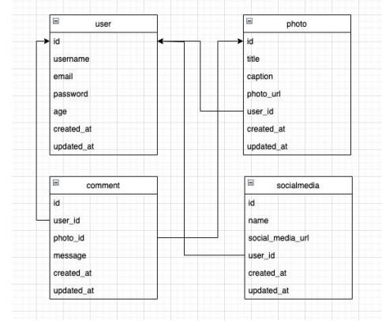

# My Gram

# final Project Program DTS KOMINFO Mintra HACTIV8

## design table

## Validation for table photo :

1.  Field title

- Validasi agar field title tidak boleh kosong

2. Field photo_url
   - Validasi agar field photo_url tidak boleh kosong atau harus terisi

## Validation for table media social :

1. Field name

- Validasi agar field name tidak boleh kosong

2. Field social_media_url

- Validasi agar field social_media_url tidak boleh kosong atau harus terisi

## Validation for table comment :

1. Field message

- Validasi agar field message tidak boleh kosong

## Flow project:

- Endpoint-endpoint untuk mengakses data pada table SocialMedia, Photo, dan Comment harus
  melalui proses autentikasi terlebih dahulu, dan proses autentitakasinya wajib menggunakan JsonWebToken.
- Untuk endpoint-endpoint yang berguna untuk memodifikasi data kepemilikan seperti Update atau
  delete maka harus melalui proses autorisasi

## Endpoint:

1. User :

- Register [POST]
- Login [POST]

2. Photo :

- GetAll [GET]
- GetOne [GET]
- CreatePhoto [POST]
- UpdatePhoto [PUT]
- DeletePhoto [DELETE]

3. Comment :

- GetAll [GET]
- GetOne [GET]
- CreateComment [POST]
- UpdateComment [PUT]
- DeleteComment [DELETE]

4. Social Media :

- GetAll [GET]
- GetOne [GET]
- CreateSocialMedia [POST]
- UpdateSocialMedia [PUT]
- DeleteSocialMedia [DELETE]
